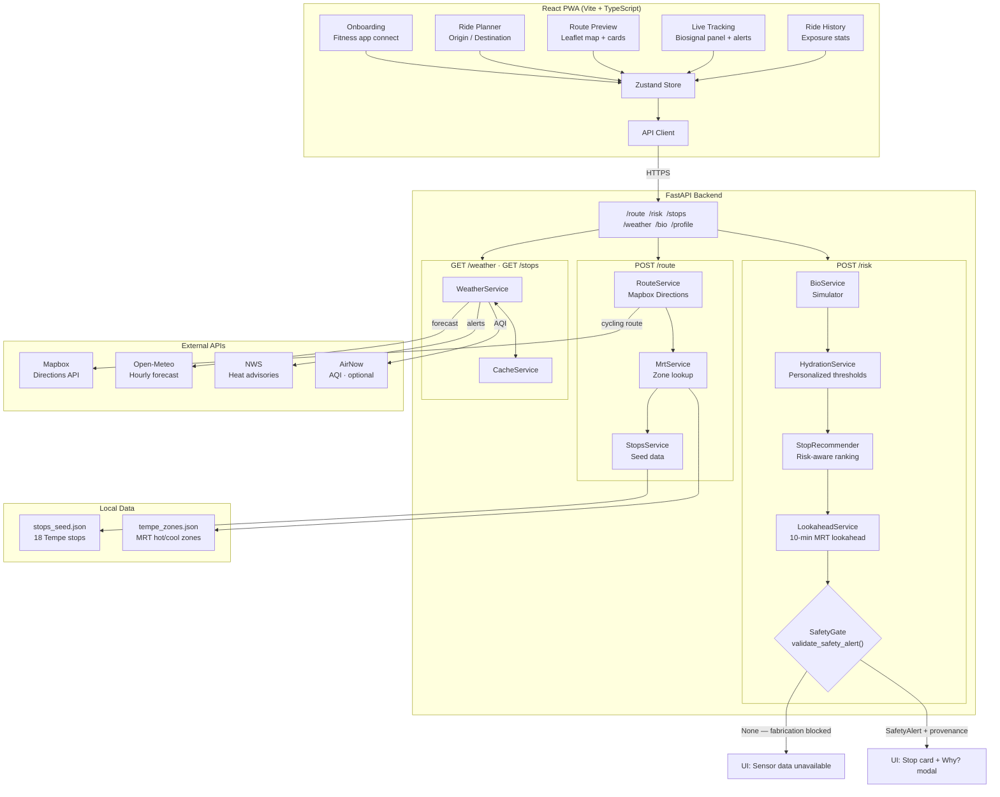

# PulseRoute

**A mobile co-pilot for cyclists in hot cities.** PulseRoute plans the coolest
and safest route between two points, monitors rider biosignals from a smartwatch
(real or simulated), and proactively suggests cool-down stops before heat illness
hits.

Built for the **Kiro Spark Challenge** at ASU, April 24, 2026.

---

## The problem

Phoenix recorded 645 heat-related deaths in 2023. Cyclists are uniquely
exposed — existing navigation apps optimize for distance, not thermal
exposure or rider physiology. A cyclist following the shortest path through
Tempe at 3 PM in July may unknowingly ride into a 60°C mean radiant
temperature corridor with no water access for two kilometers.

PulseRoute closes this gap.

---

## What makes it different

Three signals fused into one consumer app for the first time:

1. **Environmental** — Mean Radiant Temperature, shade coverage, heat advisories
2. **Infrastructural** — Water fountains, shaded rest stops, cafes, bike repair
3. **Physiological** — Heart rate, HRV, skin temperature → hydration risk score

When the model detects elevated risk, it suggests the right stop at the right
moment. Every recommendation carries a `provenance` object citing its sources.
If any source is unavailable, the app refuses to fabricate — it tells the user.

---

## The Accountability Logic Gate

Our environment-frame guardrail is a literal piece of code, not a slogan.
`backend/safety.py::validate_safety_alert()` refuses to render any safety
alert unless biosignal, environmental, and route data are all present and
fresh. This file has 100% branch coverage in its tests.

---

## Repo structure

```
.
├── backend/                    # FastAPI backend (Python 3.11)
│   ├── main.py                 # App entrypoint, lazy router registration
│   ├── safety.py               # Accountability Logic Gate (non-negotiable)
│   ├── bio_sim.py              # Biosignal simulator (HR, HRV, skin temp)
│   ├── routers/                # One router per domain
│   │   ├── health.py           # GET /health
│   │   ├── bio.py              # POST /bio/mode, GET /bio/current
│   │   ├── stops.py            # GET /stops
│   │   ├── weather.py          # GET /weather
│   │   ├── route.py            # POST /route
│   │   ├── risk.py             # POST /risk
│   │   └── profile.py          # GET/POST /profile
│   ├── services/               # Business logic
│   │   ├── hydration_service.py    # Rule-based risk classifier, personalized thresholds
│   │   ├── stop_recommender.py     # Smart stop selection (risk-aware, preference-matched)
│   │   ├── lookahead_service.py    # Predictive heat warning (10-min lookahead)
│   │   ├── route_service.py        # Mapbox routing + MRT annotation
│   │   ├── mrt_service.py          # Mean Radiant Temperature zone lookup
│   │   ├── weather_service.py      # Open-Meteo + NWS APIs
│   │   ├── stops_service.py        # Stop data with seeded Tempe dataset
│   │   ├── bio_service.py          # Biosignal session management
│   │   ├── cache.py                # In-process cache (Redis-compatible interface)
│   │   ├── user_profile_service.py # Rider profile + personalization
│   │   └── strava_service.py       # Strava integration (fitness profile import)
│   └── tests/                  # 60+ unit tests
│
├── frontend/                   # React PWA (Vite + TypeScript)
│   └── src/
│       ├── screens/            # 5 full-screen views
│       │   ├── Onboarding.tsx      # Fitness app connect + rider profile setup
│       │   ├── RidePlanner.tsx     # Origin/destination input + route request
│       │   ├── RoutePreview.tsx    # Leaflet map, route comparison cards
│       │   ├── LiveTracking.tsx    # Live map, biosignal panel, alerts
│       │   └── RideHistory.tsx     # Past rides with exposure stats
│       ├── components/
│       │   ├── ProvenanceModal.tsx # Tap-to-expand data source citations
│       │   ├── RiskBadge.tsx       # Green/Yellow/Red risk indicator
│       │   ├── BottomNav.tsx       # Tab navigation
│       │   └── Logo.tsx
│       ├── hooks/              # useBio, useRisk, useRoute, useWeather
│       ├── lib/                # api.ts, apiTypes.ts, biosim.ts, mockData.ts
│       └── store.ts            # Zustand global state
│
├── data/
│   ├── stops_seed.json         # 18 seeded Tempe water/cafe/repair stops
│   └── tempe_zones.json        # Hand-curated MRT hot/cool zones
│
├── docs/                       # Implementation notes and strategy docs
│
└── .kiro/
    ├── steering/project.md     # Team steering document
    ├── specs/                  # Kiro specs: backend, mobile, data
    ├── hooks/                  # on-save-test, pre-commit-provenance-check
    └── skills/                 # fastapi-endpoint, react-screen, etc.
```

---

## Backend API endpoints

| Method | Path | Description | Latency target |
|--------|------|-------------|----------------|
| GET | `/health` | Liveness probe — status, version, uptime | <500ms |
| POST | `/bio/mode` | Set biosignal simulation mode (`baseline` / `moderate` / `dehydrating`) | <100ms |
| GET | `/bio/current` | Current biosignal reading for a session | <100ms |
| GET | `/stops` | Water stops, cafes, repair shops filtered by bbox and amenity | <200ms |
| GET | `/weather` | Current weather, 6-hour forecast, NWS advisories, optional AirNow AQI | <800ms cold / <100ms warm (cached) |
| POST | `/route` | Fastest and PulseRoute cycling routes with MRT annotation + per-segment ETA | <2s p95 |
| POST | `/risk` | Hydration risk from biosignal + weather + ride context; returns validated `SafetyAlert` with smart stop recommendation and 10-min lookahead warning | <500ms p95 |
| GET/POST | `/profile` | Rider profile (fitness level, sensitive mode, baseline HR) | <100ms |

All endpoints return a `provenance` object citing data sources and timestamps.

---

## Key features

### Accountability Logic Gate (`backend/safety.py`)

Before any safety alert reaches the UI, `validate_safety_alert()` enforces:

1. `bio_source` is present and fresher than **60 seconds**
2. `env_source` is present and fresher than **30 minutes**
3. `route_segment_id` is not null

Any failure returns `None` — the UI shows *"Sensor data unavailable — using conservative defaults."* Never fabricates. 100% branch coverage.

### Personalized hydration thresholds (`HydrationService`)

Risk scoring adapts to the rider's profile:

- **Sensitive mode** (kids, elderly, cardiac): lower HR caps, shorter ride duration limit, stricter heat index
- **Advanced fitness**: higher HR tolerance, extended ride duration, broader heat index range
- **Beginner**: slightly more conservative than the default

Points map to `green` (0–19) → `yellow` (20–44) → `red` (45+).

### Smart stop recommender (`StopRecommender`)

Stop selection is risk-level aware:

- **Red**: routes to nearest official cooling center or AC-equipped stop, ignoring rider prefs (safety first)
- **Yellow**: preference-matched, distance-weighted ranking — `score = distance_m / amenity_match_bonus / open_bonus`

Returns a human-readable reason string displayed directly in the UI.

### Predictive lookahead (`LookaheadService`)

Projects risk **10 minutes ahead** using per-segment MRT data from the route response. If an upcoming segment crosses 45/50/55°C MRT thresholds and the projected risk total crosses a level boundary (green→yellow or yellow→red), fires an anticipatory warning *before* the rider enters the zone. Demo-able from the Live Tracking screen's debug panel.

### Biosignal simulator (`bio_sim.py`)

Three modes with realistic time-varying dynamics:

| Mode | HR | HRV | Skin temp |
|------|----|-----|-----------|
| `baseline` | ~72 bpm | ~62 ms | ~33°C |
| `moderate` | ~145 bpm | ~38 ms | ~35°C |
| `dehydrating` | ~168 bpm | ~19 ms | ~37°C |

Gaussian noise on all signals; smooth transition curves, not step changes.

---

## Frontend screens

The frontend is a **React PWA** (Vite + TypeScript + Leaflet + Zustand + Tailwind) styled to look and feel like a native mobile app.

| Screen | Description |
|--------|-------------|
| **Onboarding** | Simulated OAuth connect to Strava, Apple Fitness, Garmin, Wahoo, or Polar — imports fitness profile (fitness level, resting HR, HRV baseline) |
| **Ride Planner** | Origin/destination input, calls `/route` and `/stops`, navigates to preview |
| **Route Preview** | Leaflet map with both route polylines, route comparison cards (distance, ETA, peak MRT heat bar, water stops count), stop markers |
| **Live Tracking** | Animated position marker, 4-metric biosignal panel (HR / HRV / skin temp / ambient), persistent risk score card, smart stop card (yellow+), lookahead warning banner, Logic Gate fallback banner, demo control panel |
| **Ride History** | Past rides with distance, duration, heat exposure (°C·min), water stops taken, peak risk, route type |

---

## Implementation status

| Service | Status | Notes |
|---------|--------|-------|
| **WeatherService** | ✅ Production | Real Open-Meteo + NWS API calls with graceful degradation |
| **SafetyGate** | ✅ Production | Full Accountability Logic Gate — 100% branch coverage, non-negotiable |
| **CacheService** | ✅ Production | In-process dict with Redis-compatible interface; swap to Upstash by changing one class |
| **HydrationService** | ✅ Production | Personalized thresholds (sensitive mode, fitness level) |
| **StopRecommender** | ✅ Production | Risk-aware, preference-matched, distance-weighted ranking |
| **LookaheadService** | ✅ Production | 10-min predictive MRT lookahead with threshold crossing detection |
| **RouteService** | ⚠️ Reference impl | Mapbox Directions API is real; MRT annotation uses hand-curated zone stubs |
| **MrtService** | ⚠️ Reference impl | Hand-curated Tempe hot/cool zones; replace with rasterio raster lookup when LST data is ready |
| **StopsService** | ⚠️ Reference impl | 18-stop seed dataset; replace with `stops_tempe.geojson` from Track C |
| **BioService** | ⚠️ Reference impl | In-process simulator; replace with real HealthKit feed via EAS dev build |

**Reference implementations** have correct interface signatures and return correct schema types. Track C can drop in production code without touching any router or caller.

---

## Running the backend

```bash
# Install dependencies
pip install -r backend/requirements.txt

# Set environment variables
export MAPBOX_ACCESS_TOKEN=your_token_here
# Optional: export AIRNOW_API_KEY=your_key_here

# Run the server
uvicorn backend.main:app --reload

# Run tests
python -m pytest backend/tests/ -v

# Run tests with coverage
python -m pytest backend/tests/ --cov=backend --cov-report=term
```

Backend: `http://localhost:8000` — API docs: `http://localhost:8000/docs`

---

## Running the frontend

```bash
cd frontend
npm install
npm run dev
```

Frontend: `http://localhost:5173`

The app calls the backend at `http://localhost:8000` by default. Set `VITE_API_URL` to point at a deployed backend.

---

## External APIs

| API | Purpose | Auth |
|-----|---------|------|
| **Mapbox Directions** | Cycling routes with turn-by-turn geometry | API key required |
| **Open-Meteo** | Hourly weather forecast (temp, humidity, UV index) | None |
| **NWS** | Active weather alerts and advisories | None |
| **AirNow** | Air quality index | Optional API key (airnow.gov) |

---

## Testing

All backend services have unit tests with mocked external API calls (no real network traffic during tests).

**Test coverage**: 60+ tests passing, 100% branch coverage on SafetyGate.

```bash
# Run all tests
python -m pytest backend/tests/ -v

# Run the Logic Gate tests
python -m pytest backend/tests/test_logic_gate.py -v

# Run with coverage
python -m pytest backend/tests/ --cov=backend.safety --cov-report=term
```

---

## Architecture



---

## Phase 2 (post-hackathon)

- EAS dev build with real HealthKit / Google Fit integration
- Strava / Apple Fitness import for live personalized baselines
- rasterio MRT raster lookup replacing hand-curated zones
- Android via React Native
- Crowdsourced shade-quality validation
- Multi-modal: walk + bike + transit combinations

---

## License

MIT
